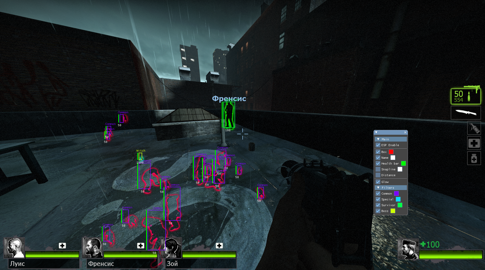

---

# L4D2 Shitty shit esp Cheat but only PVE lol
reads server.dll not client.dll, so this shit will work only on your lan server(also crashing for no reason idk)

i just hate these interfaces and etc

go fuck yourself with SDK

## Features
- Box ESP / Name ESP / Health Bar / Snapline / Distance
- Glow
- Filter: Common / Special / Boss / Survivor
- ImGui menu (INSERT)

## Build
1. Build as x86 DLL
2. Inject into `left4dead2.exe`
3. Press `INSERT`

## Build Requirements
- Visual Studio 2026
- DirectX 9 SDK

**Educational purposes only. Use at your own risk. Run with -insecure**
